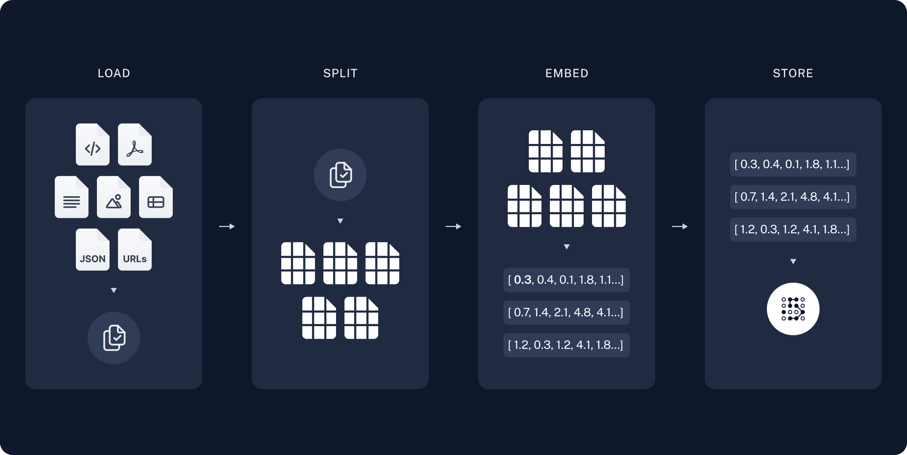
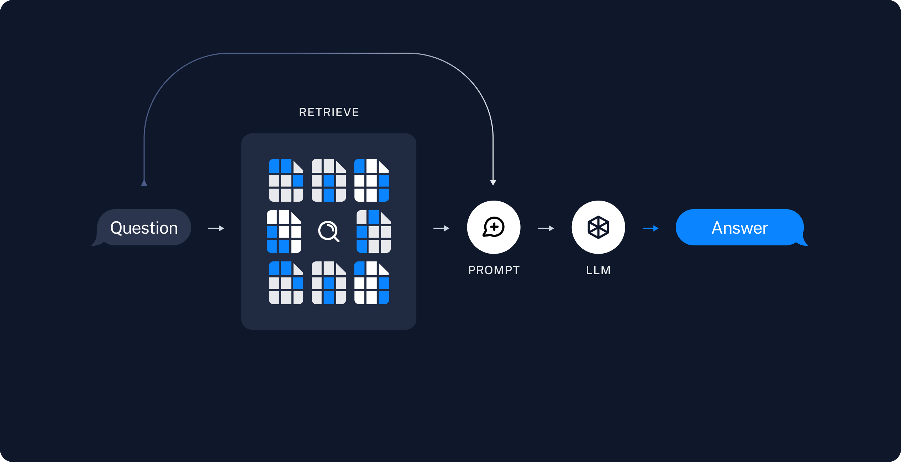

# **Indexing:** 

a pipeline for ingesting data from a source and indexing it. This usually happens offline.

# **Retrieval and generation:** 

The actual RAG chain, which takes the user query at run time and retrieves the relevant data from the index, then passes that to the model.

## _Indexing :_
1. Load: First we need to load our data. This is done with Document Loaders.
2. Split: Text splitters break large Documents into smaller chunks. This is useful both for indexing data and for passing it in to a model, since large chunks are harder to search over and won't fit in a model's finite context window.
3. Store: Store and index our splits, so that they can later be searched over. This is often done using a VectorStore and Embeddings model.

## _Retrieval and generation_
1. Retrieve: Given a user input, relevant splits are retrieved from storage using a Retriever.
2. Generate: A ChatModel / LLM produces an answer using a prompt that includes the question and the retrieved data

Create a account at https://smith.langchain.com/

Chuck the content of web (https://lilianweng.github.io/posts/2023-06-23-agent/) using WebBaseLoader  